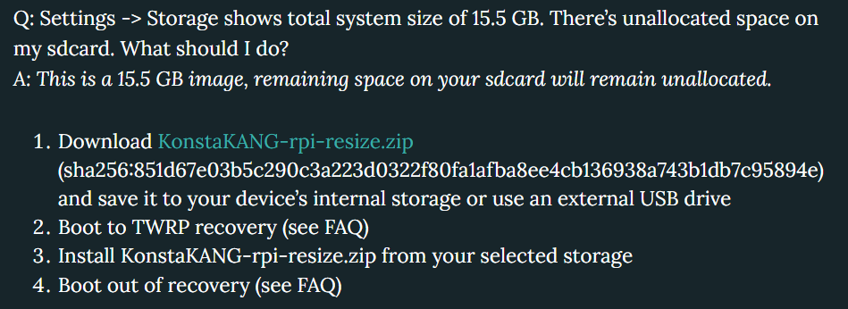
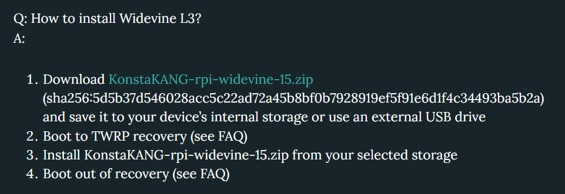
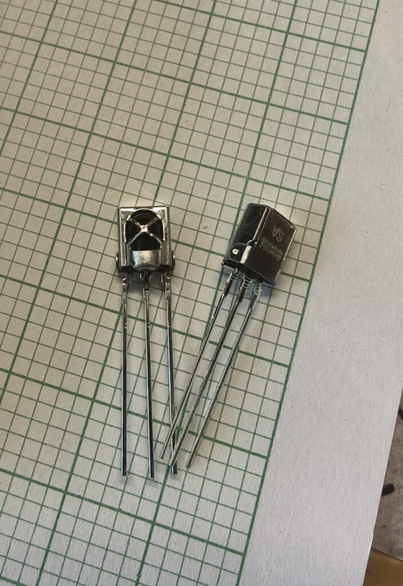
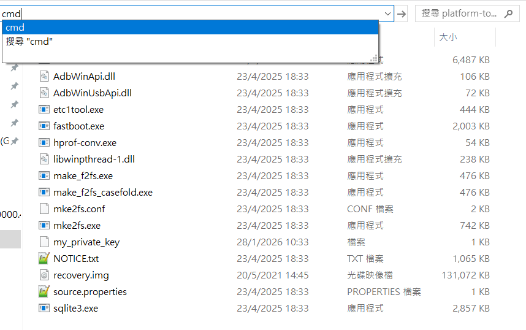
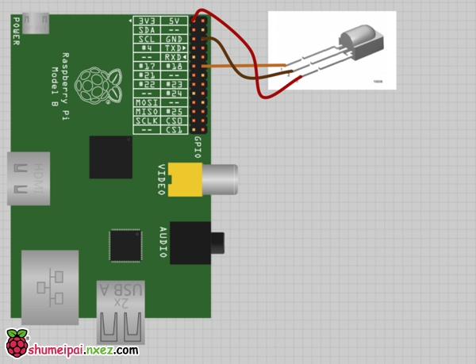
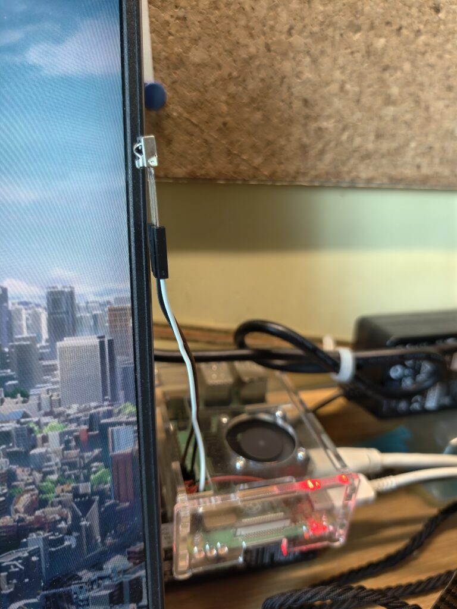

# Raspberry Pi 4 Android TV Setup

## 系統安裝

鏡像地址：[https://konstakang.com/devices/rpi4/LineageOS22-ATV/](https://konstakang.com/devices/rpi4/LineageOS22-ATV/)

燒錄鏡像：BalenaEtcher [https://etcher.balena.io/](https://etcher.balena.io/)

解壓.zip，把剛下載好的android tv 鏡像燒錄進SD Card/USB （後面會提到用USB boot的方法）預設是boot from SD Card

看到Splash Screen後要繼續等待，等到LineageOS的logo 出現就代表成功進系統了。

這時你會看到系統可用的空間只有8GB，並不是你SD Card的大小，現在我們就要下載調整容量的檔案，把它存到USB，插上Raspi，然後在設定-->系統-->先去 Buttons 裏面把Advanced restart打開，然後再到 開關和電源 裏面重啓到Recovery，再將剛才下的resize檔install（要連滑鼠），然後再重啓以便回到System。你就能看到系統擴容了。

再來便是安裝WIdevine L3（播Netflix等需要DRM授權的內容就靠它）

跟剛才一樣，也是進Recovery安裝再重啓就好了。

最重要的是安裝Google服務和Play Store，如果系統沒有預載的話我們就要到連接的Github下載。選full版本你會得到較完整的體驗，建議選full版本。跟剛才一樣，也是進Recovery安裝再重啓就好了。

### 額外設定

如果你需要在HDMI輸出聲音，請去設定-->系統-->Raspberry Pi Settings的Audio device選擇HDMI 0/1。這取決你連接了那個HDMI Port，接近電源的是 #0。當然你想透過3.5mm Jack輸出聲音保持不變就可以了，預設是3.5mm輸出。

## 推薦安裝的應用程式

#### From Play Store:

TuneIn Radio

Synology Photos：可以看SynologyNAS的相片喔

KODI

Localsend

RS File：文件管理器，用以安裝apk

如果需要瀏覽器：可以用TV Bro 使用方法詳見 [https://ivonblog.com/posts/tv-bro-browser-for-android-tv/](https://ivonblog.com/posts/tv-bro-browser-for-android-tv/)

#### From Internet:

emby：破解版會獲得更舒適的觀影體驗（需要自己架設服務器）\[docker\] [https://liteapks.com/emby-for-android-tv.html](https://liteapks.com/emby-for-android-tv.html)

BBLL：看bilibili的第三方播放器（播放設置-->視頻編碼選擇AVC才能正常播放影片）[https://github.com/xiaye13579/BBLL/releases/tag/v1.5.2](https://github.com/xiaye13579/BBLL/releases/tag/v1.5.2)

BV：同上，使用Material 3風格製作 [https://github.com/aaa1115910/bv/releases/tag/alpha-r894](https://github.com/aaa1115910/bv/releases/tag/alpha-r894)

NewPipe：開源YouTube播放器，不能等入YouTube賬號，一般用於下載影片，沒什麼用 ( ´･･)ﾉ(.\_.\`) [https://github.com/TeamNewPipe/NewPipe/releases](https://github.com/TeamNewPipe/NewPipe/releases)

SmartTube：這是我最常使用的YouTube播放器，兼具YouTube Chromecast的功能，非常好用的一款開源播放器[https://github.com/yuliskov/SmartTube/releases](https://github.com/yuliskov/SmartTube/releases)

## USB Boot

使用 Raspberry Pi Imager 更改EEPROM'的引導

在Operating System選擇 Misc utility Images

選擇對應的版本，這裏我選 Bootloader (Pi 4 family)

最後選擇USB Boot，插上SD Card燒錄一遍

把ATV的系統鏡像燒錄進USB，再修改 boot 分區下的 /boot/config.txt，在 Boot device 的欄目修改爲：

`#dtoverlay=android-sdcard`

`dtoverlay=android-usb`

`#dtoverlay=android-nvme`

在 Raspi 插入 USB 並開機，大功告成

## 紅外線遙控設置

可以購買Universal的紅外線接收器 e.g. LineageOS Konsta推薦的TSOP4838，我用的更便宜的VS1838B，效果都是一樣的。

<figure>

<figcaption>

圖爲VS1838B

</figcaption>

</figure>

首先在系統設定-->Raspberry Pi Settings 裏找到Infrared Remote並啓用 & 打開SSH，並在 開發人員選項 裏打開 Android debugging 和 adb root shell 才能以root權限使用adb。

- 在電腦下載platform-tools [https://developer.android.com/tools/releases/platform-tools?hl=zh-tw](https://developer.android.com/tools/releases/platform-tools?hl=zh-tw)

解壓後在檔案欄打上cmd，以直接使用在該目錄下的檔案。

由於Android 沒有使用者帳戶和密碼，因此改用基於密鑰的 SSH 認證。在首次系統啟動時會生成必要的密鑰，你需要將私鑰提取到電腦上（或者你也可以將先前生成的密鑰推送到設備）。請參見「設定」->「系統」->「關於」->「狀態」->「IP 地址」來查看設備的 IP 地址（此處以 192.168.0.100 爲例）。

`adb connect 192.168.0.100`

`adb root`

`adb pull /data/ssh/ssh_host_ed25519_key my_private_key`

`chmod 600 my_private_key #Run this if you are on linux/mac`

`ssh -i my_private_key root@192.168.0.100`

建議在操作完成後關閉 android 的 adb 來保障系統安全。

### 紅外接收器引腳

將你的紅外接受器根據圖示接上 Raspi 的 GPIO 引腳，接不同顏色的杜邦線會更容易區分引腳。

要留意的是在樹莓派上用紅外傳感器需要接 3.3V 電壓，如需接 5V 的話請使用一個 100Ω 的電阻避免燒壞接收器。

如果你像我一樣接了 Raspi 散熱風扇的話，接地（GND）可以選擇其他地方，這邊附上一張引腳圖

VCC (3.3V) \[Pin 01/17\], GND, OUT \[Pin 18\]

圖中使用AndroidTV定義的 GPIO18，但Raspberry Pi OS 預設定義的引腳是 GPIO17，如你想要在Raspberry Pi OS測試的話請改爲Pin 17

使用Notepad++等文本編輯器，創建一個名爲rc\_keymap.txt 的檔案，留意換行格式和編碼需要轉爲Unix LF，UTF-8，不然linux系統不能識別這個文檔。

將遙控器的鍵位圖放置在 /boot/rc\_keymap.txt，以便在系統開機時自動加載

- SSH進系統後我們打上 ir-keytable -p all -t 來測試遙控器鍵位的16進制代碼

這時系統會顯示提示，要求你按下遙控器上的按鍵。首先按下方向鍵上的「上」鍵，記下 scancode= 後面的值（就是鍵值）。逐一替換下面的鍵值，最後將文件保存到 /boot/rc\_keymap.txt。

格式如下：不需要的但又不想刪除可以打#號注釋掉

`# table mytvsuper_remote, type: nec`

`0xdf001c KEY_POWER`

`# 0xdf0018 KEY_MENU`

`0xdf000a KEY_HOMEPAGE`

`0xdf001a KEY_UP`

`0xdf0007 KEY_RIGHT`

`0xdf0047 KEY_LEFT`

`0xdf0048 KEY_DOWN`

`0xdf0049 KEY_BACK`

`0xdf0006 KEY_ENTER`

`0xdf0004 KEY_VOLUMEUP`

`0xdf0018 KEY_VOLUMEDOWN`

`0xdf0019 KEY_REWIND`

`0xdf0058 KEY_FASTFORWARD`

`0xdf0001 KEY_PLAYPAUSE`

`0xdf005f KEY_STOP`

`0xdf005c KEY_MUTE`

`0xdf000c KEY_0`

`0xdf0054 KEY_1`

`0xdf0016 KEY_2`

`0xdf0015 KEY_3`

`0xdf0050 KEY_4`

`0xdf0012 KEY_5`

`0xdf0011 KEY_6`

`0xdf004c KEY_7`

`0xdf000e KEY_8`

`0xdf000d KEY_9`

`0xdf0010 KEY_BACKSPACE`

此時拿來你的遙控器逐一對上不同的按鍵就完成key binding的步驟了。

具體Android TV上的鍵位參考官方的遙控器

如發現你的遙控器對着接收器按沒有反應的話，檢查以下的事項：

- 確認你的遙控器是紅外遙控器：用手機攝像頭拍攝一下，如果有光的就是紅外遙控。如果是藍牙遙控器，可以直接用設定-遙控器和配件進行配對，效果也很好（實測使用手機安裝藍牙遙控的軟件連接電視會有串鍵的情況）

- 米家的遙控器使用了自有的協議，解碼存在問題；在獲取鍵值過程中通常無效

- 原文中的 KEY\_OK 沒有測試成功，換成 KEY\_ENTER 後測試有效。網上有人使用 AKB7291 遙控器成功，其實一般電視/機頂盒遙控器都能用，如果你手頭上有閒置的也可以拿來測試。

- 實測使用無論是機頂盒還是電視的遙控器都能成功遙控Android TV

## 效果

開心使用中

## 參考資料

[https://shumeipai.nxez.com/2021/02/25/use-raspberry-pi-4b-to-create-pure-atv-10.html](https://shumeipai.nxez.com/2021/02/25/use-raspberry-pi-4b-to-create-pure-atv-10.html)

https://shumeipai.nxez.com/2016/01/17/infrared-remote-control-remote-raspberry-pi.html

[https://konstakang.com/devices/rpi4/LineageOS22-ATV](https://konstakang.com/devices/rpi4/LineageOS22-ATV)

[https://www.instructables.com/Booting-a-Raspberry-Pi-From-USB-No-SD-Card-Needed](https://www.instructables.com/Booting-a-Raspberry-Pi-From-USB-No-SD-Card-Needed)
